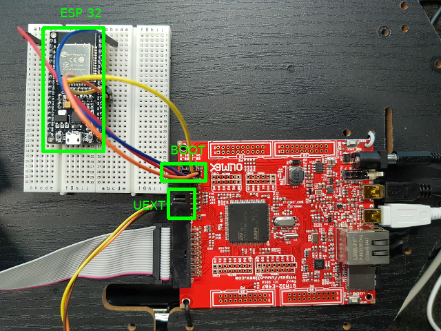

# Hardware setup for the Kobuki demo

### ChangeLog

 * 16th June 2020: Document stable setup with use of AP.
 * 11th October 2019: Documented basic setup, RTS/CTS still missing.

## Overview

On an abstract level, the following diagram depicts the components used and their connections

The main parts, from the perspective of Micro-ROS, are the robot and the Olimex STM32-E407 board. The WiFi Access-Point and the powerbank are just there to provide wireless networking, since the Olimex board doesn't have integrated WiFi.

## Part List

### Off-the-shelf parts
 
 * Turtlebot 2 base
 * Olimex STM32-E407 board with headers on "PD"
 * USB-OTG cable: Mini-AB to A
 * USB cable: A to B

### Custom parts

 * Serial cable between Kobuki base and Olimex board
    * DB25 male header
    * 3 wires
    * 
 * Power cable from Kobuki to Olimex board
    * Molex 43025-0208 connector
    * DC barrel jack for 2mm pin in 6.3mm hole, positive on pin
    

## Relevant Datasheets / Documentation

This tutorial is intended to be self-contained, but if you're interested in background, or find a problem, the following references might helpful.

### For the demo hardware

 * Kobuki ("Turtlebot 2") Robot
    * [User Guide with parallel port pinout](https://docs.google.com/document/d/15k7UBnYY_GPmKzQCjzRGCW-4dIP7zl_R_7tWPLM0zKI/edit#bookmark=id.jso1h9boryth)
 * Olimex STM32-E407
    * [Olimex STM32-E407 User Guide](https://www.olimex.com/Products/ARM/ST/STM32-E407/resources/STM32-E407.pdf)
    * [UEXT pinout](https://www.olimex.com/Products/ARM/ST/STM32-E407/resources/STM32-E407.pdf#15)
    * [PD pinout](https://www.olimex.com/Products/ARM/ST/STM32-E407/resources/STM32-E407.pdf#18)

### For debug tools

 * [FTDI TTl232-3v3 cable pinout](https://www.ftdichip.com/Support/Documents/DataSheets/Cables/DS_TTL-232R_CABLES.pdf#page=11)
 

## Wiring

This is how the result of wiring looks:

### Locations
 * *parallel* is the the Kobuki parallel port
 * *UEXT* is the extension connector on the Olimex STM32-E407 board
 * *BOOT* is USART3 on the Olimex board
 * *PG* is the PG3 pin row on the Olimex board
 
Here I have marked these on the boards:

TODO: Add PG marker once we have the board soldered right.

|  Source  | SName  | Pin | Meaning | Dest | DName | Dest Pin |
|----------|--------|-----|---------|------|-------|----------|
| Parallel | GND    | 14  | Ground  | UEXT | GND   | 2        |
| Parallel | RX     | 1   | Serial  | UEXT | TX    | 3        |
| Parallel | TX     | 2   | Serial  | UEXT | TX    | 4        |
