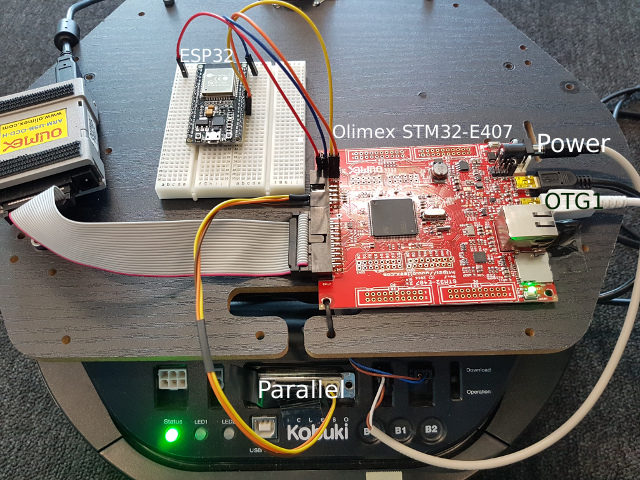

# Hardware setup for the Kobuki demo

WORK IN PROGRESS

## Parts

### Off-the-shelf parts
 
 * Turtlebot 2 base
 * Olimex STM32-E407 board with headers on "PD"
 * SBC-ESP32-NodeMCU
 * Breadboard
 * 6 prototyping wires for connecting Olimex and ESP32
 * USB-OTG cable: Mini-AB to A
 * USB cable: A to B

### Custom parts

 * Serial cable between Kobuki base and Olimex board
    * DB25 male header
    * 3 wires
    * TODO: add 
 * Power cable from Kobuki to Olimex board
    * Molex 43025-0208 connector
    * DC barrel jack 2mm for 6.3mm jack, positive on pin
    

## Relevant Datasheets / Documentation

This tutorial is intended to be self-contained, but if you're interested in background, or find a problem, the following references might helpful.

### For the demo hardware

 * Kobuki ("Turtlebot 2") Robot
    * [User Guide with parallel port pinout](https://docs.google.com/document/d/15k7UBnYY_GPmKzQCjzRGCW-4dIP7zl_R_7tWPLM0zKI/edit#bookmark=id.jso1h9boryth)
 * Olimex STM32-E407
    * [Olimex STM32-E407 User Guide](https://www.olimex.com/Products/ARM/ST/STM32-E407/resources/STM32-E407.pdf)
    * [UEXT pinout](https://www.olimex.com/Products/ARM/ST/STM32-E407/resources/STM32-E407.pdf#15)
    * [PD pinout](https://www.olimex.com/Products/ARM/ST/STM32-E407/resources/STM32-E407.pdf#18)
 * ESP32 (used for transparent WiFi)
   * [ESP32 AT Firmware Download](https://www.espressif.com/en/support/download/at)
   * [ESP32 Pinout Reference](https://randomnerdtutorials.com/esp32-pinout-reference-gpios/)
   * [Source for ESP32 AT Firmware](https://github.com/espressif/esp-at)
   * [ESP32 Getting Started Guide with Pinouts](https://github.com/espressif/esp-at/blob/master/docs/ESP_AT_Get_Started.md)

### For debug tools

 * [FTDI TTl232-3v3 cable pinout](https://www.ftdichip.com/Support/Documents/DataSheets/Cables/DS_TTL-232R_CABLES.pdf#page=11)
 

## Wiring

This is how the result of wiring looks:

### Locations
 * *parallel* is the the Kobuki parallel port
 * *UEXT* is the extension connector on the Olimex STM32-E407 board
 * *BOOT* is UASRT3 on the Olimex board
 * *PG* is the PG3 pin row on the Olimex board
 * *ESP32* is the ESP32

Here I have marked these on the boards:

TODO: Add PG marker once we have the board soldered right.

|  Source         | SName | Pin | Meaning | Dest   | Dest Pin |
|-----------------|-------|-----|---------|--------|----------|
| Kobuki Parallel | RX    | 1   | Serial  | Olimex UEXT | 